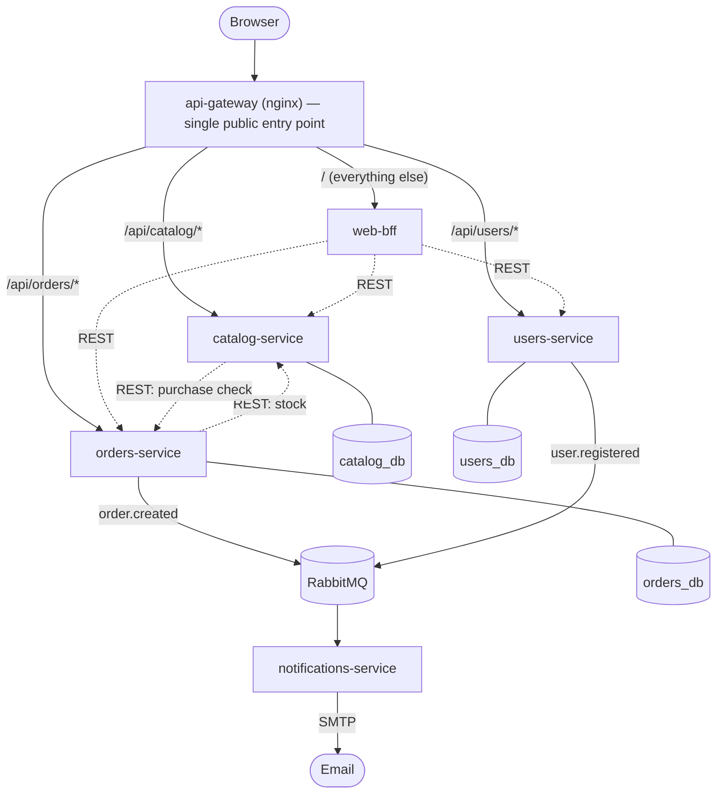

# 🎮 Gaming Store


A 5-service e-commerce microservices platform — REST + async events, one
database per service, JWT auth, and a full DevOps toolchain (Docker,
Kubernetes, GitOps, CI/CD, application security, observability) built
around it. Started as a Laravel monolith; rebuilt from scratch into this,
phase by phase, with every phase actually deployed and tested against real
containers/clusters before being marked done — see [`plan.md`](plan.md) for
the complete build log, including every bug that was found and how.

## Architecture



Solid arrows cross the gateway (client-facing); dotted arrows are direct
service-to-service calls that never do — see
[`docs/architecture.md`](docs/architecture.md) for the full breakdown,
including *why* each of those design choices (JWT over a sync auth call,
RabbitMQ over a sync notification call, database-per-service and what it
costs) rather than just what they are.

| Service | Responsibility | Database |
|---|---|---|
| [`catalog-service`](services/catalog-service) | Products, categories, photos, reviews | `catalog_db` |
| [`orders-service`](services/orders-service) | Cart, checkout, payments, coupons | `orders_db` |
| [`users-service`](services/users-service) | Auth (issues JWTs), favorites, newsletter | `users_db` |
| [`notifications-service`](services/notifications-service) | Consumes events, sends email | — (worker, no DB) |
| [`web-bff`](services/web-bff) | Renders the site, orchestrates the 3 APIs | — (BFF, no DB) |

## DevOps practices applied

Each phase below was built, deployed against a real Docker/Kubernetes
environment, and verified — not just written. `plan.md` has the full story
per phase, bugs found included; this is the summary.

| Area | What's here |
|---|---|
| **Containers** | A multi-stage `Dockerfile` per service; `docker-compose.yml` orchestrating 15 containers (5 services, 3 MySQL, RabbitMQ, gateway, and the full observability stack below) |
| **Kubernetes** | Kustomize `base`/`overlays` (`dev`/`prod`), Deployments/StatefulSets/Services/Ingress/PVCs/Secrets, deployed and tested on a real cluster — [`k8s/`](k8s) |
| **GitOps** | Argo CD, git as the single source of truth for what's deployed, `selfHeal` tested by deliberately drifting the cluster and watching it self-correct — [`docs/gitops.md`](docs/gitops.md) |
| **CI/CD** | GitHub Actions: per-service change detection (only rebuilds what changed), lint (Pint), 98 tests, `composer`/`npm audit`, Trivy image scan, Semgrep SAST, gitleaks secret scanning, GHCR image publish — [`.github/workflows/ci.yml`](.github/workflows/ci.yml) |
| **Application security** | Security headers, rate limiting, centralized JWT validation, internal-endpoint authentication, OWASP Top 10 mapping — [`SECURITY.md`](SECURITY.md) |
| **Observability** | Prometheus + Grafana (Golden Signals), real distributed tracing to Jaeger across services *and* the async RabbitMQ boundary, structured JSON logs correlated by trace ID via Loki — [`docs/observability.md`](docs/observability.md) |
| **Testing** | 98 PHPUnit feature tests across the 4 HTTP services, run in CI on every push | 

## Quickstart (Docker Compose)

```bash
git clone https://github.com/achrafes20/Gaming_store.git
cd Gaming_store
bash scripts/setup-env.sh   # generates .env + shared secrets for all 5 services
docker compose up --build
```

Then:

- Site: <http://localhost:8080>
- RabbitMQ management UI: <http://localhost:15672> (guest/guest)
- Grafana: <http://localhost:3000> (admin/admin) — dashboards provisioned automatically
- Prometheus: <http://localhost:9090>
- Jaeger: <http://localhost:16686>

Register an account via the site, then promote it to admin (there's no
seeded admin — every account starts as `client`):

```bash
docker compose exec users-service php artisan tinker \
  --execute="\App\Models\User::where('email', 'you@example.com')->update(['role' => 'admin']);"
```

### On Kubernetes

```bash
bash scripts/k8s-deploy.sh dev
```

Builds the 5 images, applies secrets, deploys `k8s/overlays/dev`, waits for
every rollout, runs migrations. See [`docs/gitops.md`](docs/gitops.md) for
the Argo CD-managed release flow used beyond this first deploy.

## Tests

```bash
cd services/<service> && php artisan test    # 98 tests total, across the 4 HTTP services
./vendor/bin/pint --test                       # code style
```

Also run automatically in CI on every push — see the badge at the top.

## Documentation

- [`docs/architecture.md`](docs/architecture.md) — service breakdown, why each major design choice was made
- [`SECURITY.md`](SECURITY.md) — security controls and OWASP Top 10 mapping
- [`docs/gitops.md`](docs/gitops.md) — Argo CD setup and the release flow
- [`docs/observability.md`](docs/observability.md) — metrics, tracing, logs
- [`plan.md`](plan.md) — the complete build log, phase by phase
